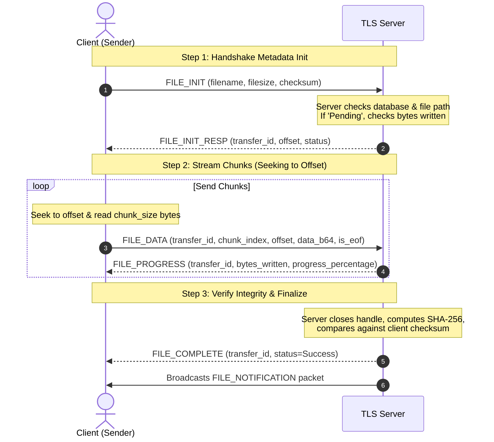

# Secure TCP Chat Application (TLS & PySide6 GUI)

A professional, high-performance, multithreaded TCP Chat Application built in Python. Secure communications are handled natively via Transport Layer Security (TLS), featuring an elegant desktop interface built with PySide6, robust role-based access controls (RBAC), and chunked file transfers (FTProto).

---

## 1. System Architecture

The application implements a decoupled, event-driven client-server architecture utilizing secure TLS sockets:

```mermaid
graph TD
    subgraph Client Application (PySide6)
        GUI[PySide6 UI Thread]
        QueueTimer[QTimer Queue Poller]
        ClientSock[SocketClient Thread]
        Uploader[File Uploader Thread]
        
        GUI <-->|Non-blocking Signals| QueueTimer
        QueueTimer <-->|Packet Queues| ClientSock
        Uploader -->|TCP Stream| ClientSock
    end

    subgraph TLS Cryptographic Layer
        TLSClient[ssl.PROTOCOL_TLS_CLIENT]
        TLSServer[ssl.PROTOCOL_TLS_SERVER]
        TLSClient <-->|Encrypted TCP/IP Tunnel| TLSServer
    end

    subgraph Secure Server (Multithreaded)
        Acceptor[Acceptor Thread]
        Handler[Client Handler Threads]
        Presence[Presence Daemon Thread]
        SQLite[(SQLite DB Manager)]

        TLSServer --> Acceptor
        Acceptor -->|Spawn| Handler
        Handler <--> SQLite
        Presence <--> SQLite
    end

    ClientSock <--> TLSClient
    TLSServer <--> Acceptor
```

### Component Details
* **PySide6 UI Thread**: Orchestrates the user interface elements (Login, Chat workspace, Admin console) completely decoupled from TCP socket loop blocking.
* **QTimer Queue Poller**: Checks the incoming queue every 100ms thread-safely, preventing GUI freezes.
* **Client Handlers**: Independent threads spawned per client on the server to handle incoming packets concurrently.
* **Presence Monitor**: A background server daemon checking inactivity every 5 seconds, updating idle statuses in memory and database tables.

---

## 2. Database Schema

The system uses an SQLite relational database schema (`chat_room.db`) to enforce constraints, authenticate users, map room memberships, audit moderation actions, and track file chunks.

```mermaid
erDiagram
    users ||--o| permissions : "has"
    users ||--o{ messages : "sends"
    users ||--o{ files : "transfers"
    rooms ||--o{ messages : "contains"
    rooms ||--o{ room_members : "tracks"
    users ||--o{ room_members : "joins"

    users {
        INTEGER id PK
        VARCHAR username UNIQUE
        VARCHAR password_hash
        VARCHAR status "Online / Offline / Idle"
        TIMESTAMP last_seen
    }

    permissions {
        INTEGER id PK
        INTEGER user_id FK
        VARCHAR role "Admin / Moderator / User"
    }

    rooms {
        INTEGER id PK
        VARCHAR name UNIQUE
        INTEGER creator_id FK
    }

    room_members {
        INTEGER room_id FK
        INTEGER user_id FK
        PRIMARY_KEY room_id_user_id
    }

    messages {
        INTEGER id PK
        INTEGER sender_id FK
        INTEGER room_id FK "NULL for Private Messages"
        INTEGER recipient_id FK "NULL for Room Broadcasts"
        TEXT content
        TIMESTAMP sent_at
    }

    files {
        INTEGER id PK
        INTEGER sender_id FK
        VARCHAR filename
        INTEGER filesize
        VARCHAR sha256_hash
        VARCHAR status "Pending / Completed / Failed"
        TIMESTAMP uploaded_at
    }

    logs {
        INTEGER id PK
        VARCHAR level "INFO / WARNING / ERROR"
        VARCHAR source "SERVER / CLIENT"
        TEXT message
        TIMESTAMP timestamp
    }
```

---

## 3. Protocol Specification (FTProto)

To support chunked transfer, resume logic, and integrity verification, the client and server exchange custom JSON-framed packets:

### Framing Format
Each network packet is framed using a 4-byte big-endian integer specifying payload size, followed by the raw JSON payload.

### Handshake Sequence & Resume Logic



---

## 4. API Packet Definitions

### A. Authentication
#### Register Account (`REGISTER`)
```json
{
  "message_type": "REGISTER",
  "payload": {
    "username": "bob",
    "password": "securepassword"
  }
}
```

#### Login (`LOGIN`)
```json
{
  "message_type": "LOGIN",
  "payload": {
    "username": "bob",
    "password": "securepassword"
  }
}
```

### B. Messages & Presence
#### Send Room Message (`MSG`)
```json
{
  "message_type": "MSG",
  "room": "General",
  "payload": {
    "text": "Hello, world!"
  }
}
```

#### Send Private Message (`PM`)
```json
{
  "message_type": "PM",
  "receiver": "alice",
  "payload": {
    "text": "Secret chat message"
  }
}
```

#### Presence Broadcast (`PRESENCE`)
```json
{
  "message_type": "PRESENCE",
  "payload": {
    "username": "bob",
    "status": "Idle"
  }
}
```

### C. Admin & Moderation
#### Promotion (`PROMOTE_USER`)
```json
{
  "message_type": "PROMOTE_USER",
  "payload": {
    "target": "bob",
    "role": "Moderator"
  }
}
```

---

## 5. UI Layout & Navigation Flow

The desktop GUI implements a modern dark-mode aesthetic with standard view navigation:

```
+-----------------------------------------------------------------+
| Login / Register View                                           |
|                                                                 |
|   [  Username Input  ]                                          |
|   [  Password Input  ]                                          |
|   [      Log In      ]  ---> (Transitions to Chat Dashboard)   |
|   [  Create Account  ]                                          |
+-----------------------------------------------------------------+

Transitions to:

+-----------------------------------------------------------------+
| Main Chat Dashboard (900x650)                                   |
+-------------------+------------------------------+--------------+
| Left Sidebar      | Center Chat Panel            | Right Panel  |
|                   |                              |              |
| [Rooms List]      | Room Header: #General        | [Online Users|
| - General         | +--------------------------+ |  - Alice (ON)|
| - TeamAlpha       | | Alice: Hello Bob!        | |  - Bob (Idl)|
|                   | | System: Welcome Bob!     | |              |
| [Transfer Hist]   | +--------------------------+ |              |
| - report.pdf (OK) | [📁 File] [😊 Emoji] [Input] |              |
|                   |                              |              |
| [Admin Dashboard] | Active File Status Panel     |              |
| [Log Out]         | ProgressBar [==========] 45% |              |
+-------------------+------------------------------+--------------+
```

---

## 6. Installation & Certification

### Dependencies Setup
1. Clone the repository and navigate into the workspace.
2. Initialize virtual environment:
   ```bash
   python3 -m venv .venv
   source .venv/bin/activate
   pip install -r requirements.txt
   ```

### SSL/TLS Certificate Generation
Generate standard self-signed certificate keys in the root directory:
```bash
openssl req -new -newkey rsa:2048 -days 365 -nodes -x509 -keyout server.key -out server.crt -subj "/CN=localhost"
```

### Running the System
* **Server**: `python server/main.py`
* **Desktop GUI Client**: `python client/gui/app.py`
* **CLI Client (alternative)**: `python client/main.py`

---

## 7. Testing Guide

The system includes test suites covering unit functions and integration performance.

### A. Run Unit Tests (PyTest)
Executes database, protocol parsing, and encryption validation tests:
```bash
pytest tests/test_secure_chat.py
```

### B. Run Performance Load Simulation
Starts a performance test simulating 50 clients, message flood throughput, connection drops, and 5MB chunked transfers:
```bash
python tests/test_performance_integration.py
```

---

## 8. Deployment Guide (Production)

To deploy the server in a production Linux environment:

### 1. Configure Systemd Daemon Service
Create a systemd unit service file `/etc/systemd/system/secure-chat.service`:
```ini
[Unit]
Description=Secure TLS TCP Chat Server
After=network.target

[Service]
Type=simple
User=chatuser
WorkingDirectory=/opt/secure-chat
ExecStart=/opt/secure-chat/.venv/bin/python server/main.py
Restart=on-failure
RestartSec=5

[Install]
WantedBy=multi-user.target
```

### 2. Enable and Start Service
```bash
sudo systemctl daemon-reload
sudo systemctl enable secure-chat.service
sudo systemctl start secure-chat.service
```

---

## 9. Troubleshooting

* **SSL Loading Failure (`ssl.SSLError: [SSL] key values mismatch`)**:
  Ensure the `server.crt` and `server.key` match and were generated in the directory where the server is executed.
* **SQLite Database Lock (`sqlite3.OperationalError: database is locked`)**:
  Verify that only one server instance is running on the machine. Multiple parallel client processes do not lock database tables, as they communicate solely via the single server instance.
* **PySide6 Client Fails to Start on Linux (X11 connection issues)**:
  Ensure `DISPLAY` environment variables are properly exported. If running inside Docker, configure X11 forwarding forwarding parameters.

---

## 10. Future Improvements

1. **End-to-End Encryption (E2EE)**: Implement client-side cryptographic message encryption (e.g. Signal Double Ratchet algorithm), using server TLS purely as transport envelope routing.
2. **Horizontal Clustering**: Implement Redis message brokers to sync states across multiple distributed servers.
3. **WebRTC Integration**: Integrate voice and video conferencing capabilities directly into the PySide6 client GUI.
